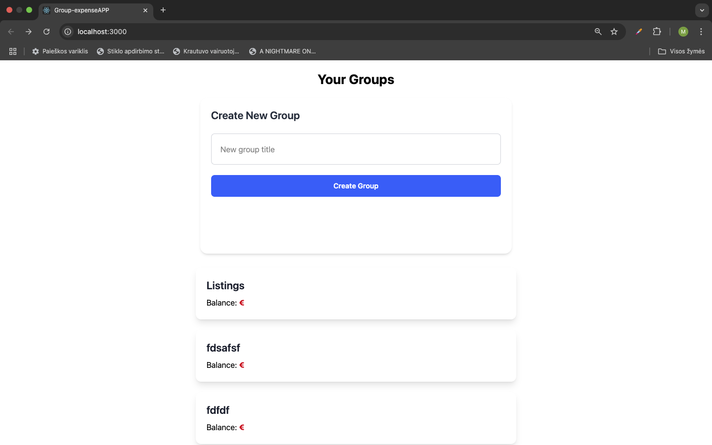
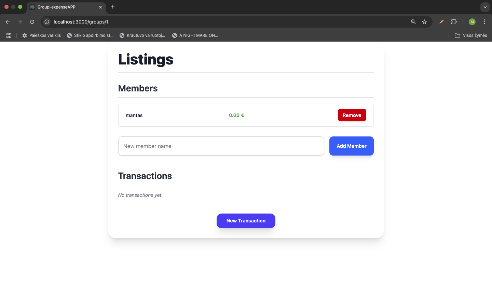
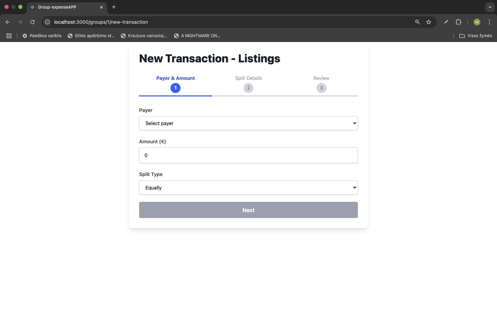

 
 
 

# group-extense 
Ši programa yra reaktyvi (React + TypeScript) žiniatinklio aplikacija grupiniam išlaidų dalinimuisi, skirta padėti draugų grupėms ar šeimoms kaupti ir dalintis bendras išlaidas.

## Klonuokite repozitoriją

git clone https://github.com/mantas-eng/group-expense.git
cd group-expense

### Naudojimas
Ši svetainė sukurta naudojant Tailwind Ji naudoja Font Awesome ikonoms.

#### Funkcijos

- responsive designas
- naršymo meniu su stiliaus pakeitimais
- Tailwind 
- Formos ir įvesties laukų stiliai
- env
- typescript
- backend palaikymas
- vite

##### Prielaidos

Prieš paleisdami programą, įsitikinkite, paleidziant su

- ASP.NET Core and an EF Core in-memory database
- npm

###### Instaliacija

1. Nusiklonuokite šį repozitoriją į savo kompiuterį.
2. Atsidarykite terminalą ir pakeiskite direktoriją į klonuotą repozitoriją.
3. Įvykdykite šias komandas:

```bash
npm install react react-dom react-router-dom
npm install -D vite tailwindcss postcss autoprefixer
npx tailwindcss init -p
npm install sass
npm install @fortawesome/fontawesome-svg-core @fortawesome/free-solid-svg-icons @fortawesome/free-brands-svg-icons @fortawesome/react-fontawesome

npm run start
